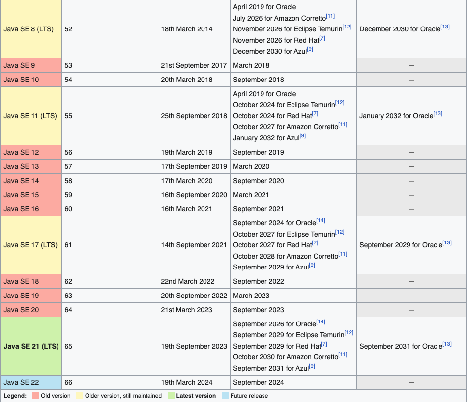

# Java versions and their main news for developers.:heart_eyes:

Project used to know a little about what is best in Java versions.

## Index :pushpin:

- [Java Version List](#java-version-list)
- [Java 9](#java9)
- [Java 10](#java10)
- [Java 11](#java11)
- [Java 12](#java12)
- [Java 13](#java13)
- [Java 14](#java14)
- [Java 15](#java15)
- [Java 16](#java16)
- [Java 17](#java17)
- [Java 18](#java18)
- [Java 19](#java19)
- [Java 20](#java20)
- [Java 21](#java21)

## Java Version List <a name="java-version-list"></a> :link:

References Synced 2023-11-02: _[Wikipedia](https://en.wikipedia.org/wiki/Java_version_history)._ 


## Java 9 <a name="java9"></a>:heart:

#### JavaDoc

- Now it has a search field, if you generate your project's javadoc, or get a third-party javadoc, you can perform searches, making developers even easier.

#### JShell

- With _`JShell`_ we have the possibility to execute Java commands via terminal in a simple way, we don't need so much code to start executing basic commands in java.

#### Jigsaw - Modularized Java

- Now we can write code in a modular way, so that we can choose which java package we will use in our code, by default Java comes with several packages, from Strings, IO, etc ... however with modular Java, we can choose the that we want to use, that way our final package is much smaller and only with what we need. _[(Jigsaw Project)](https://openjdk.java.net/projects/jigsaw/)_

## Java 10 <a name="java10"></a>:heart:

- Time-based releases._[(JEP 322)](http://openjdk.java.net/jeps/322)_
- Type inference for variables _`locals`_._[(JEP 286)](http://openjdk.java.net/jeps/286)_

```java
public void example() {
    //Java 9
    Integer i = 9;
    String s = "Java ";
    System.out.println(s + i);

    //Java 10
    var x = 10;
    var y = "Java ";
    System.out.println(y + x);
}
```

## Java 11 LTS <a name="java11"></a>:heart:

#### Type annotations in lambda expressions

Before:
```
(valor, conversorMoeda) -> conversorMoeda.converter(valor);
```

After:
```
(@Nonnull var valor, @Nonnull var conversorMoeda) -> conversorMoeda.converter(valor);
```

#### The Java HTTP client gains a standardization

- In Java 11, the API is consolidated, even the exchange of the _`jdk.incubator.http`_ package by _`java.net.http`_ was carried out, implementing a non-blocking communication model, similar to that used by Nodejs . In addition, the API also supports HTTP 1.1 / 2, which makes it a much more robust option compared to the URLConnection API.

## Java 12 <a name="java12"></a>:heart:

#### String Methods (indent and transform)

Indent: will place an indentation in the code with the space size defined by a number.
```java
String msg = "Hello\nWorld!".indent(3);
```

Transform: We can call these calls and return a String transformed into new values, we can use it as a 'concat' as well.
```java
String msg = "Hello".transform(s -> s + ", World!").transform(String::toUpperCase);
```

#### Switch Expressions. (preview)_[(JEP 325)](http://openjdk.java.net/jeps/325)_

- We no longer need to use the word _`break`_, we can separate the values with a comma.

Before:
```java
switch (day) {
    case MONDAY:
    case FRIDAY:
    case SUNDAY:
        System.out.println("A");
        break;
    case TUESDAY:
        System.out.println("B");
        break;
    case THURSDAY:
    case SATURDAY:
        System.out.println("C");
        break;
    case WEDNESDAY:
        System.out.println("D");
        break;
}
```

After:
```java
switch (day) {
    case MONDAY, FRIDAY, SUNDAY -> System.out.println("A");
    case TUESDAY                -> System.out.println("B");
    case THURSDAY, SATURDAY     -> System.out.println("C");
    case WEDNESDAY              -> System.out.println("D");
}
```

Switch can now return value too:
```java
private static String switchNew(Days day){
    return switch (day) {
        case MONDAY, FRIDAY, SUNDAY, TUESDAY  -> "A";
        case THURSDAY, SATURDAY               -> "C";
        default                               -> "D";
    };
}
```

## Java 13 <a name="java13"></a>:heart:

- Switch Expressions functionality continues in preview._[(JEP 325)](http://openjdk.java.net/jeps/325)_
- Text Blocks (Preview)._[(JEP 355)](http://openjdk.java.net/jeps/355)_

## Java 14 <a name="java14"></a>:heart:

- Switch Expressions Release._[(JEP 361)](http://openjdk.java.net/jeps/361)_
- Text Blocks Release. _[(JEP 368)](http://openjdk.java.net/jeps/368)_
- Helpful NullPointerExceptions._[(JEP 358)](http://openjdk.java.net/jeps/358)_
- Pattern Matching for instanceof (Preview)._[(JEP 305)](http://openjdk.java.net/jeps/305)_

Before:
```java
if (obj instanceof String) {
    String s = (String) obj;
    // use s
}
```

After:
```java
if (obj instanceof String s) {
    // now will you use 's' here
}
```

#### Records

- Records (Preview)._[(JEP 359)](http://openjdk.java.net/jeps/359)_

The record is equivalent to a class with:

- A private and final attribute for each informed argument;
- A public constructor that uses all arguments;
- Getters;
- toString;
- equals and hashCode.
- We can't use it for Hibernate/JPA, because those lib need to have empty constructors and methods setters

To enable this preview, use the following flag:
```
javac --enable-preview --release 14 BankTransaction.java
```

Before:
```java
public class ExempleRecord {
    private final int x;
    private final int y;
    public Ponto(int x, int y) {
        this.x = x;
        this.y = y;
    }
    public int getX() {
        return x;
    }
    public void setX(int x) {
        this.x = x;
    }
    public int getY() {
        return y;
    }
    public void setY(int y) {
        this.y = y;
    }
    @Override
    public String toString() {
        return "Ponto{" +
                "x=" + x +
                ", y=" + y +
                '}';
    }
    @Override
    public boolean equals(Object o) {
        if (this == o) return true;
        if (o == null || getClass() != o.getClass()) return false;
        Ponto ponto = (Ponto) o;
        return x == ponto.x &&
                y == ponto.y;
    }
    @Override
    public int hashCode() {
        return Objects.hash(x, y);
    }
}
```

After:
```java
record ExempleRecord(int x, int y) { }
```

Other Example:
```java
public record Product(Long id, String name, String description) implements Serializable {
    public static int CONT = 0;
    public void myMethod () {}
}
```

## Java 15 <a name="java15"></a>:heart:

- Sealed Classes (Preview) _[(JEP 360)](https://openjdk.org/jeps/360)_
- Pattern Matching for instanceof (Second Preview) _[(JEP 375)](https://openjdk.org/jeps/375)_
- Text Blocks _[(JEP 378)](https://openjdk.org/jeps/378)_
- Records (Second Preview) _[(JEP 384)](https://openjdk.org/jeps/384)_
    - We can declare 'records' in the method directly

## Java 16 <a name="java16"></a>:heart:

- Pattern Matching for instanceof _[(JEP 394)](https://openjdk.org/jeps/394)_
- Records _[(JEP 395)](https://openjdk.org/jeps/395)_
- Sealed Classes (Second Preview) _[(JEP 397)](https://openjdk.org/jeps/397)_

Pattern Matching for instanceof example:

Before:
```java
public static void patternMatching (Object num) {
    if (num instanceof Integer) {
        Integer n = (Integer) num;
        System.out.printin (n);
    }
}
```

After:
```java
public static void patternMatching (Object num) {
    if (num instanceof Integer n) {
        System.out.printin (n);
    }
}
// Other Example (must be used just with &&)
public static void patternMatching (Object num) {
    if (num instanceof Integer n && n > 0) {
        System.out.printin (n);
    }
}
```

Sealed Classes example:
```java
// This 'sealed' means: I seal the classes and declare which child classes will be able to extend it, only the declared classes can be extended, I seal and lock this class, no other will extend it, only those that are within the "permits"
public sealed abstract class GeometricFigure permits Square, Circle {
    
    protected String colour;
    
    public abstract double calculateArea();
    
    public String getColour () {
        return colour:
    }
    public void setColour (String colour) {
        this.colour
    }
}

// This 'final' means: cannot be extended
public final class Square extends GeometricFigure {
    
    protected Double side;
    
    public String getSide () {
        return side:
    }

    @Override
    public double calculateArea() {
        return 0;
    }
}

// This 'non-sealed' means: it is not sealed, that is, other classes can extend this class and use it
public non-sealed class Circle extends GeometricFigure {
    
    protected Double radius;
    
    public String getRadius () {
        return radius:
    }

    @Override
    public double calculateArea() {
        return 0;
    }
}

// Using these classes above
public static void calculateArea (GeometricFigure figure) {
    if (figure instanceof Square square) {
        return square.getSide() * square.getSide();
    }
    if (figure instanceof Circle circle) {
        return circle.getRadius() * circle.getRadius() * Math.PI;
    }
}
```

## Java 17 LTS <a name="java17"></a>:heart:

- Pattern Matching for Switch
- Sealed Classes
- Removals and Deprecation
- Strongly Encapstulate JDK internals

After:
```java
public static String getResult (Object value) {
    return switch(value){
        case String s ->  "A String of Length: " + s.length();
        case List list && list.size() > 1000 ->  "A large list of size: " + list.size();
        case List list ->  "A list of size: " + list.size();
        case Map map ->  "A map(key,value) of size: " + map.size();
        case Map map ->  "A set, unique elements: " + set.size();
        default -> "Unknown data structure!";
    }
}

// Other Example
public static String getLeagueDescription (FootballLeague league) {
    return switch(value){
        case null -> "Invalid league";
        case LA_LIGA -> "Spanish Football League";
        case PL -> "Premiere League";
    }
}
```

## Java 18 <a name="java18"></a>:heart:

- Simple web server _[(JEP 430)](https://openjdk.org/jeps/408)_
- UTF-8 by default _[(JEP 400)](https://openjdk.org/jeps/400)_
- Core Reflection
- Vector API _[(JEP 430)](https://openjdk.org/jeps/417)_
- Foreign Function & Memory API (Second Incubator) _[(JEP 419)](https://openjdk.org/jeps/419)_
- Javadoc code snippets
- Deprecating Finalization for Removal

## Java 19 <a name="java19"></a>:heart:

- Record Patterns (Preview) _[(JEP 405)](https://openjdk.org/jeps/405)_
- Pattern Matching for Switch (Third Preview) _[(JEP 427)](https://openjdk.org/jeps/427)_
- Foreign Function e Memory API (Preview) _[(JEP 424)](https://openjdk.org/jeps/424)_
- Vector API (Fourth Incubator) _[(JEP 426)](https://openjdk.org/jeps/426)_
- Virtual Threads (Preview) _[(JEP 425)](https://openjdk.org/jeps/425)_
- Structured Concurrency (Incubator) _[(JEP 428)](https://openjdk.org/jeps/428)_

## Java 20 <a name="java20"></a>:heart:

- Record Patterns (Second Preview) _[(JEP 432)](https://openjdk.org/jeps/432)_
- Pattern Matching for Switch (Fourth Preview) _[(JEP 433)](https://openjdk.org/jeps/433)_
- Scoped Values (Incubadora) _[(JEP 429)](https://openjdk.org/jeps/429)_
- Virtual Threads (Second Preview) _[(JEP 436)](https://openjdk.org/jeps/436)_
- Structured Concurrency (Second Incubator) _[(JEP 437)](https://openjdk.org/jeps/437)_
- Foreign Function & Memory API (Second preview) _[(JEP 434)](https://openjdk.org/jeps/434)_
- Vector API (Fifth Incubator) _[(JEP 438)](https://openjdk.org/jeps/438)_

## Java 21 LTS <a name="java21"></a>:heart:

- String Templates (Preview) _[(JEP 430)](https://openjdk.org/jeps/430)_
- Sequenced Collections _[(JEP 431)](https://openjdk.org/jeps/431)_
- Record Patterns _[(JEP 440)](https://openjdk.org/jeps/440)_
- Pattern Matching for switch _[(JEP 441)](https://openjdk.org/jeps/441)_
- Unnamed Patterns and Variables (Preview) _[(JEP 443)](https://openjdk.org/jeps/443)_
- Unnamed Classes and Instance Main Methods (Preview) _[(JEP 445)](https://openjdk.org/jeps/445)_
